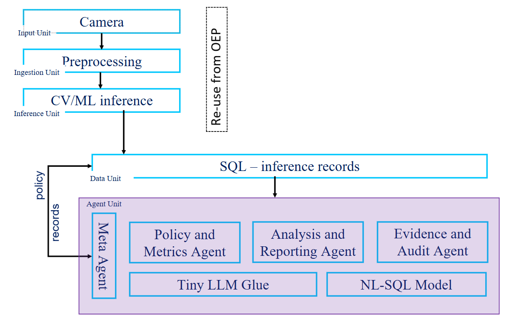
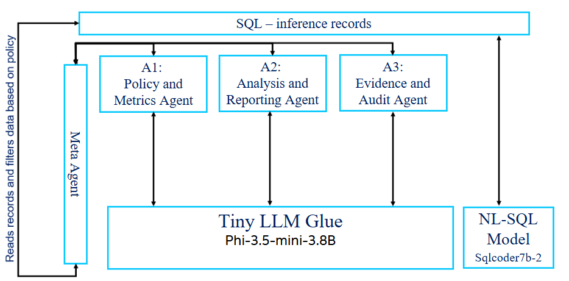

# Predictive Maintenance Pipeline

The **predictive_maintenance_pipeline** project demonstrates a complete *agentic edge AI system* for **Predictive Maintenance (PdM)** of critical infrastructure (e.g., pipelines, bridges, solar panels) using Intel Edge hardware and software stack.

It combines real-time **inference**, structured **data storage**, and a multi-agent reasoning layer coordinated by a **Meta-Agent**.

> **Note:** The terms **PACE** (PdM using Agents for Critical infrastructure on the Edge) and **predictive_maintenance_pipeline** are used interchangeably throughout this project.

> **This is a Proof of Concept (PoC) and is not intended for production systems.** Use at your own risk — we take no responsibility for any deployment, data usage, or results. Currently, this PoC supports only the **pipeline defect detection** use case.



See also: [CONTRIBUTING.md](CONTRIBUTING.md) · [SECURITY.md](SECURITY.md)

---

## Quick Start

See **[QUICKSTART.md](docs/user-guide/QUICKSTART.md)** for setup, training, model conversion, and running the pipeline.

---

## System Overview

The architecture consists of three major units:

### 1. Input / Inference / Ingestion Unit
- **Intel DLStreamer** (OpenVINO) inference pipeline
- YOLO object detection on Intel iGPU or CPU
- Inline visualization via `gvawatermark`
- Video and image mode support
- Detections written to SQLite

### 2. Data Unit — SQLite
- Embedded, serverless database at `out/sql_data/detections.db`
- Stores per-frame detections (label, confidence, bounding box)
- Supports text-to-SQL via SQLCoder model (optional)

### 3. Agent Unit — Multi-Agent Orchestrator
A **hub-and-spoke** agentic system powered by **LangGraph**:



| Agent | Role |
|--------|------|
| **Meta-Agent** | Central coordinator; orchestrates all agents |
| **Policy Agent** | Applies filtering and threshold rules via SQL |
| **Analysis Agent** | Generates summaries and confidence statistics |
| **Evidence Agent** | Stores justifications and decisions for traceability |
| **LLM Glue Layer** | Text-to-SQL, schema validation, reasoning |

All agents communicate **only through the Meta-Agent** — no direct agent-to-agent messaging.

**LLM Modes:** `fallback` (rule-based, no LLM) · `model` (local OpenVINO LLM) · `server` (remote LLM server)

---

## Project Structure

```
pace/
├── src/
│   ├── agents/              # Multi-agent system (meta, policy, analysis, evidence)
│   │   └── utility/         # LLM client, DB backend, state, caching
│   └── utility/             # SQLite client, prompt loader
├── scripts/                 # Download data/models, run agents, LLM server, utilities
├── setup/                   # setup.sh, convert_to_openvino.py, requirements.txt
├── config/                  # Use-case YAML configs
├── models/
│   ├── pt_models/           # PyTorch models
│   └── ov_models/           # OpenVINO models (YOLO + LLMs)
├── datasets/                # Dataset files and dataset.yaml
├── prompts/                 # Agent prompt templates per use case
├── docs/user-guide/         # Documentation
├── web_app/                 # Web application interface
├── out/                     # Output (SQLite DB, agent reports, visualizations)
├── config.json              # Main config (use-case-id)
├── run_complete_pipeline.py # End-to-end pipeline
├── run_inference_oep.py     # DLStreamer inference
└── interactive_chat.py      # Interactive agent chat
```

---

## Configuration

**`config.json`** — Sets the active use case:
```json
{ "use-case-id": "pipeline_defects_detection" }
```

**`config/pipeline_defects_detection.yaml`** — Use-case specific settings for inference, agents, LLM mode, and SQL. See the file for all options.

---

## Documentation

| Document | Description |
|----------|-------------|
| [QUICKSTART.md](docs/user-guide/QUICKSTART.md) | Setup, training, model conversion, running the pipeline |
| [AGENT_ARCHITECTURE.md](docs/user-guide/AGENT_ARCHITECTURE.md) | Agent system design |
| [LLM_SERVER.md](docs/user-guide/LLM_SERVER.md) | LLM server architecture |
| [TROUBLESHOOTING.md](docs/user-guide/TROUBLESHOOTING.md) | Common issues and solutions |
| [prompts/README.md](prompts/README.md) | Agent prompt format guide |

---

## References

- [Intel OpenVINO Documentation](https://docs.openvino.ai/)
- [OpenVINO GenAI](https://github.com/openvinotoolkit/openvino.genai)
- [Ultralytics YOLO Documentation](https://docs.ultralytics.com/)
- [LangGraph Documentation](https://langchain-ai.github.io/langgraph/)
- [SQLite Documentation](https://www.sqlite.org/docs.html)

---

---

## License

Predictive Maintenance Pipeline is licensed under the [Apache License 2.0](LICENSE.md).

The project also includes Intel binary components (`openvino`, `openvino-genai`, `optimum-intel[openvino]`, `dlstreamer`) governed by the [Intel Simplified Software License (Version October 2022)](LICENSE.md).

See [THIRD-PARTY-PROGRAMS](THIRD-PARTY-PROGRAMS) for the full list of third-party dependencies and their license terms.

> **Note:** This project uses [Ultralytics YOLO](https://github.com/ultralytics/ultralytics) which is licensed under **AGPL-3.0**. Commercial use without open-sourcing your application requires a separate commercial license from Ultralytics.

For quick start instructions, see [QUICKSTART.md](docs/user-guide/QUICKSTART.md).
