# Using the Web Interface

This guide walks through the web-based interface for running the predictive
maintenance pipeline, interacting with agent outputs, and managing tickets — all
from the browser.

## Launching the Web UI

```bash
conda activate pace
python scripts/launch_web_app.py
```

The server starts at `http://localhost:5000`. Open this URL in your browser to
access the interface.

---

## Home Page

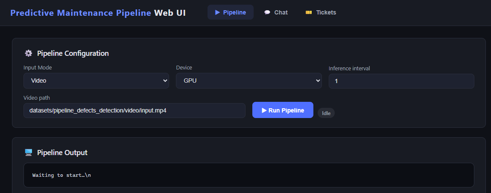

The home page is the central hub of the web interface. From here you can:

- **Run the Pipeline** — trigger the complete end-to-end inference and agent
  orchestration pipeline
- **Ask & Analyze** — interact with the analysis, evidence, and SQL chat agents
- **View Tickets** — browse and inspect generated defect tickets

---

## Running the Pipeline

Click the pipeline execution controls on the home page to start a run. The
interface supports both video and image input modes, with configurable device
target (GPU, CPU, NPU) and inference interval settings.

### Pipeline Output — In Progress

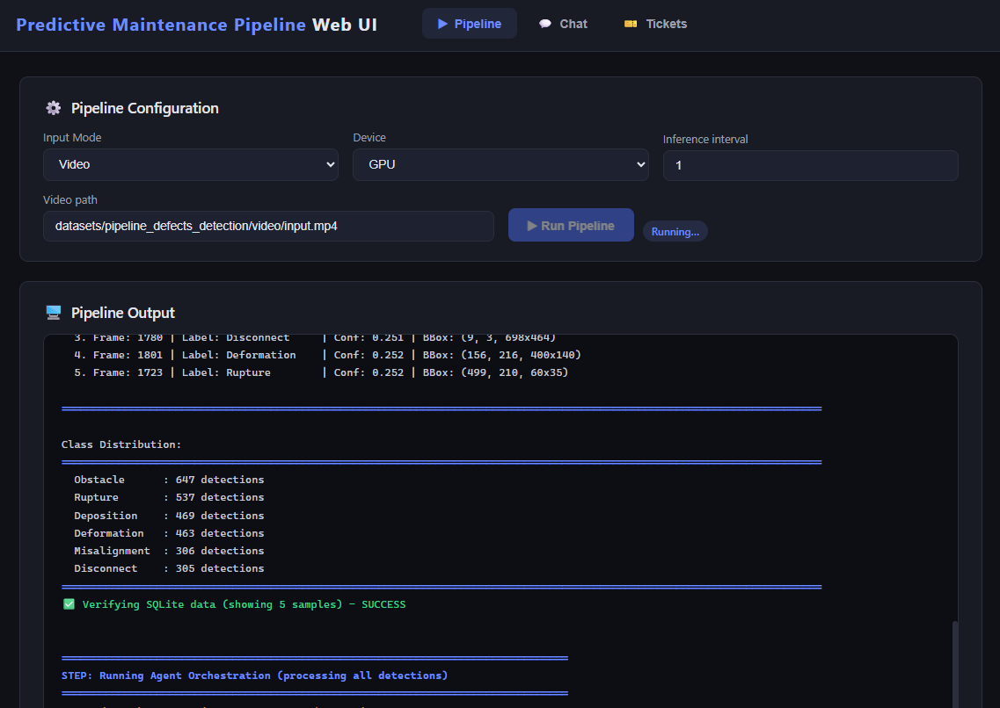

Once the pipeline starts, output is streamed to the browser in real time via
server-sent events. You can monitor:

- YOLO inference progress (frame-by-frame detection)
- SQLite ingestion status
- Agent orchestration phases (Policy → Analysis → Evidence)

### Pipeline Output — Complete

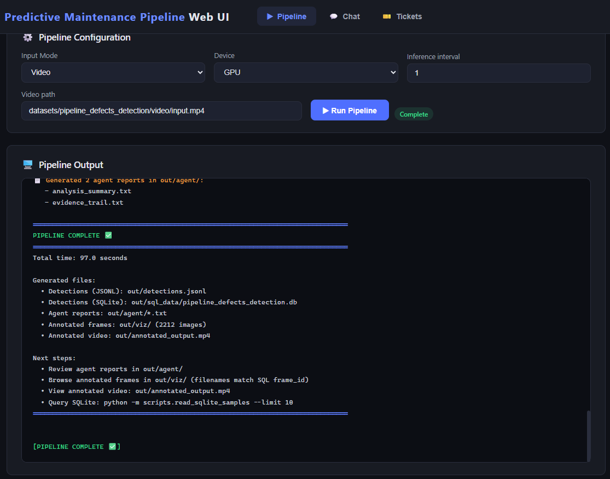

When the pipeline finishes, a completion status is displayed. All output artifacts
— detection database, analysis reports, evidence audit trails — are now available
for querying through the chat interface and for ticket creation.

---

## Ask & Analyze

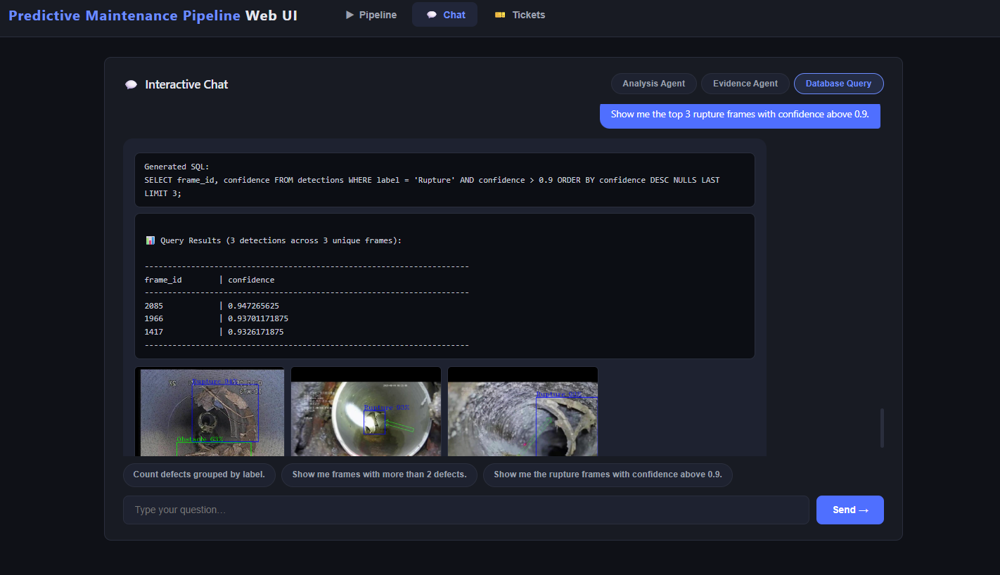

The **Ask & Analyze** section provides an interactive chat interface with three
distinct agent modes. Select the mode that matches your query type, then type your
question or select from predefined questions.

### Analysis Agent

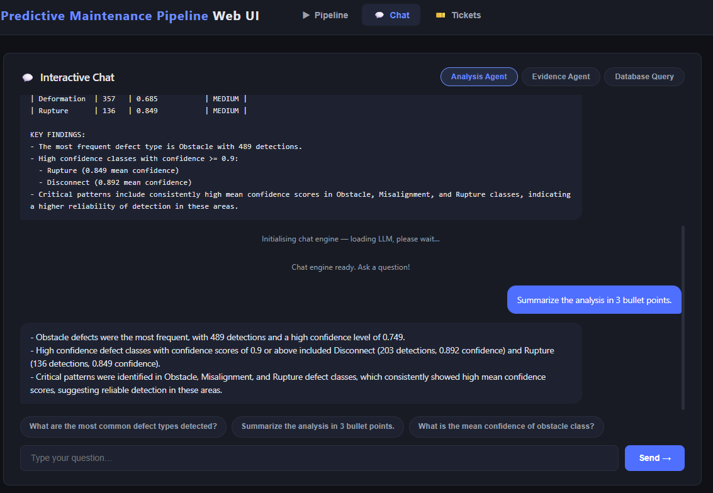

The **Analysis** mode queries the analysis summary produced by the Analysis Agent.
Ask questions like:

- Detected defect types and their frequency
- Confidence score distributions across classes
- Summary statistics and key findings

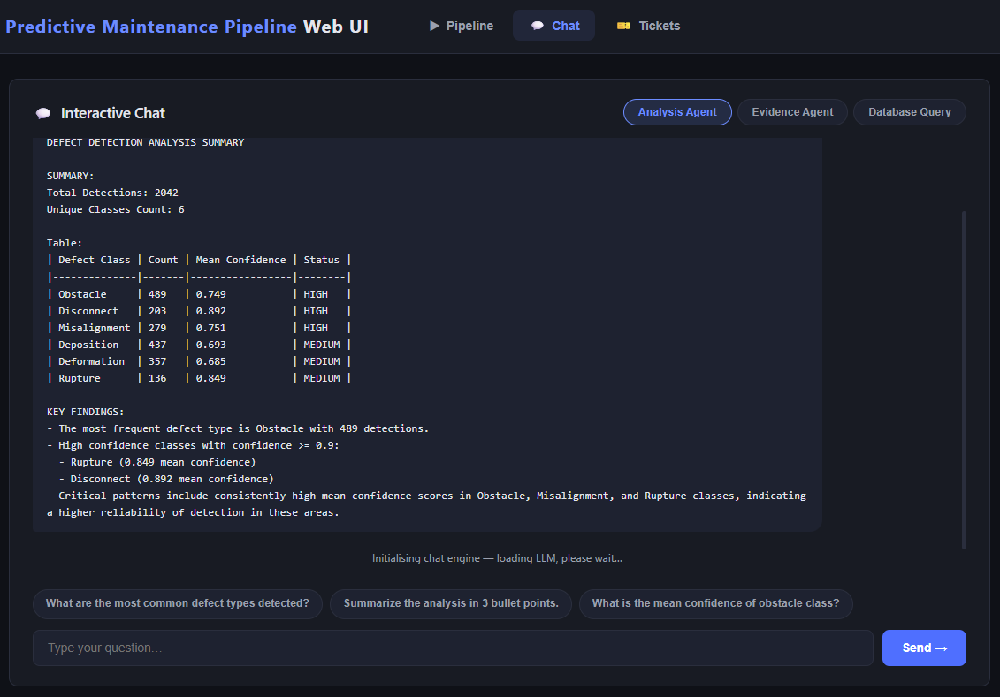

The agent responds with context-aware answers drawn from the structured analysis
report. Predefined questions are available for common queries such as "What are
the most common defect types detected?" and "What is the mean confidence of
obstacle class?" Feel free to edit or change the query.

### Evidence Agent

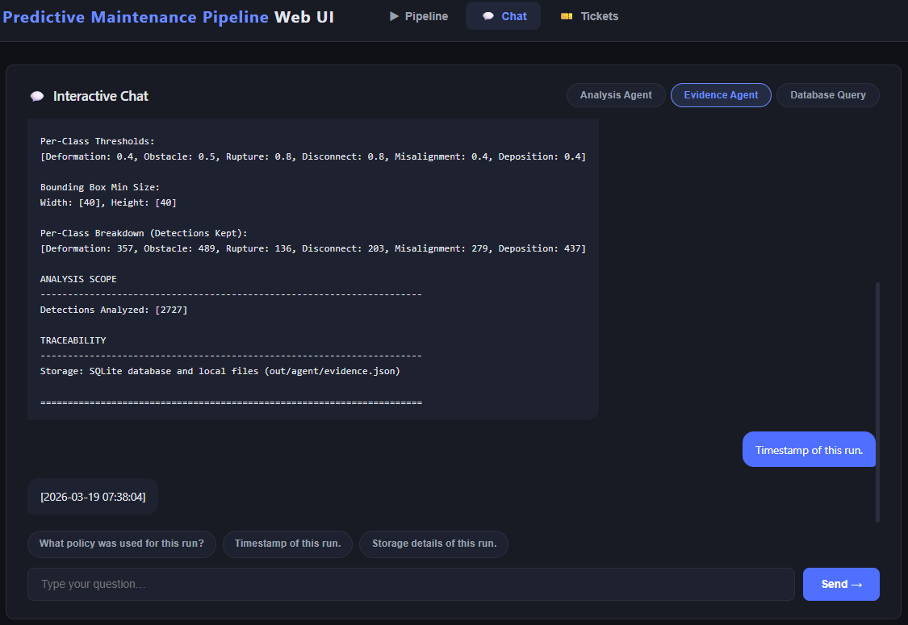

The **Evidence** mode queries the audit trail produced by the Evidence Agent. Ask questions like:

- Policy rules applied during the run
- Detection filtering metrics and compliance rates
- Run timestamps and traceability details

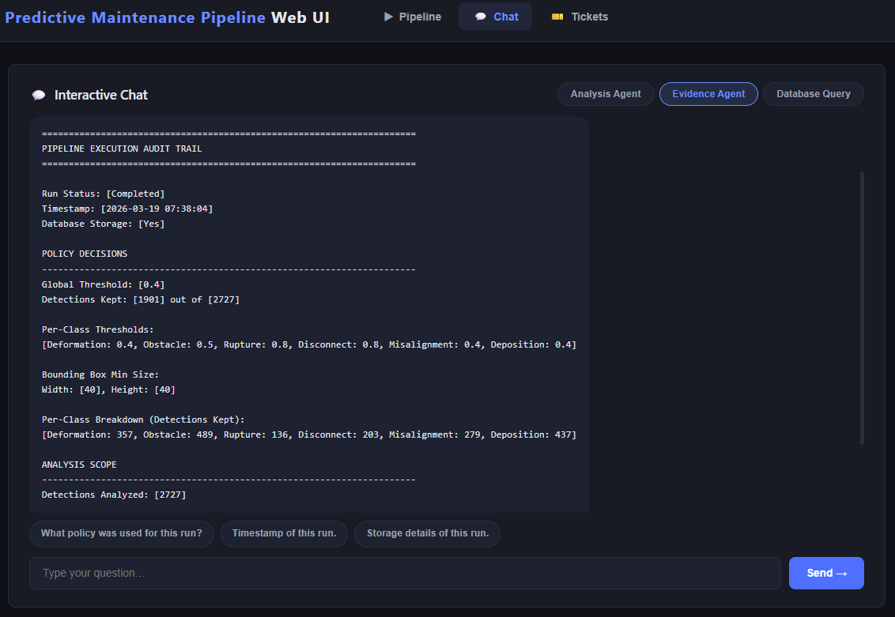

Predefined questions include "What policy was used for this run?" and "Timestamp
of this run." The evidence agent provides auditable, compliance-oriented answers
grounded in the run's evidence trail. Feel free to edit or change the query.

### Database Query Mode

The **Database Query** mode translates natural language questions into SQL queries against the
detections database. Ask questions like:

- "Count defects grouped by label"
- "Show me frames with more than 2 defects"
- "Show me the rupture frames with confidence above 0.9"

The interface displays both the generated SQL query and the formatted results.
When query results include `frame_id` columns, the corresponding frames are
available for ticket creation directly from the results view.

---

## Ticketing

### Creating Tickets During Analysis

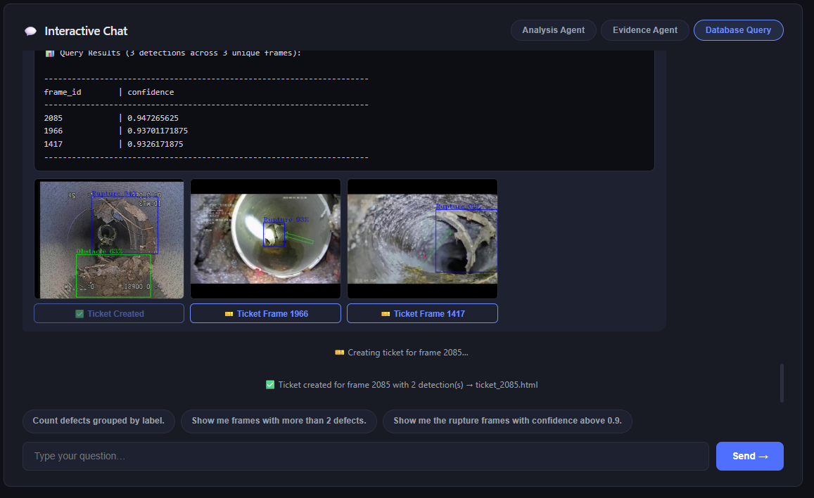

While reviewing analysis results or SQL query outputs, you can create tickets for
specific frames directly from the interface. Click the ticket creation control on
any frame to generate a self-contained HTML ticket with detection imagery,
bounding box overlays, and defect metadata.

### Viewing Open Tickets

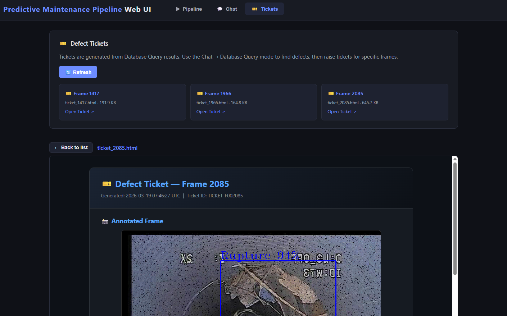

The **Tickets** section lists all generated tickets. Each entry shows the frame ID
and file size, with a direct link to open the ticket.

### Ticket Details

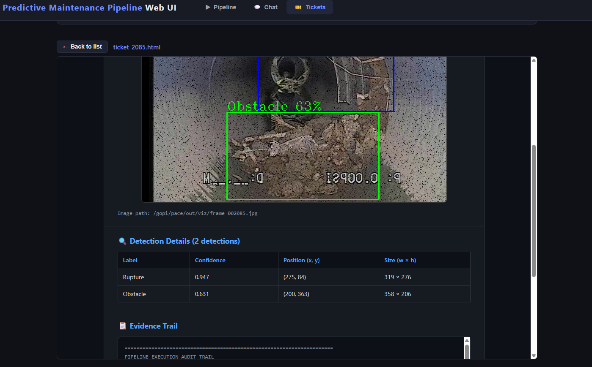

Each ticket is a self-contained HTML document that includes:

- The source frame image with bounding box overlays
- Defect class labels and confidence scores for each detection
- Frame metadata and detection coordinates

Tickets are portable — they require no database access or server connection to
view, making them suitable for offline review and handoff to maintenance teams.
